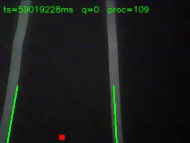

# Autonomous Car Lane-Scoring Backend

A Python backend for ingesting an ESP32-CAM MJPEG stream, buffering sampled frames, running lane detection, and exposing control and monitoring APIs for validation and future scoring phases.

## Current Implementation Status

This repository currently includes:

- **Phase 1 (core streaming pipeline): implemented**
  - Stream ingestion from ESP32 MJPEG endpoint
  - Thread-safe frame queue between producer and consumer
  - Live MJPEG forwarding endpoint (`/video_feed`)
  - Optional MinIO frame upload support
- **Phase 2 (lane detection): implemented**
  - OpenCV lane detection integrated into queue consumer
  - Calibration endpoint to compute pixel-to-centimeter scaling
  - Debug output frames with overlays saved under `debug_frames/`
- **Controls and observability: implemented**
  - Pause/resume queue ingestion with API controls
  - Runtime stats and health endpoints

Planned phases (sign detection, scoring engine, test controller, dashboard integration) remain future work.

## System Architecture

### Runtime components

1. **`StreamReceiver` (Thread A)**
   - Reads frames from the MJPEG stream (`ESP32_STREAM_URL`)
   - Updates latest frame for live feed
   - Samples frames (target `QUEUE_SAMPLE_FPS`) and pushes to queue
   - Optionally uploads original frames to MinIO
2. **`FrameQueue`**
   - Thread-safe bounded queue (`QUEUE_MAX_SIZE`)
   - Drop-on-full behavior to prioritize fresh data
3. **`QueueConsumer` (Thread B)**
   - Pops sampled frames
   - Runs lane detection pipeline
   - Saves processed debug frames
4. **FastAPI service**
   - Exposes APIs for health, stats, calibration, stream control, and video feed

## Repository Structure

```text
.
├── backend/
│   ├── config.py
│   ├── frame_queue.py
│   ├── lane_detector.py
│   ├── main.py
│   ├── queue_consumer.py
│   └── stream_receiver.py
├── debug_frames/
├── esp32/
│   └── camera_stream/
├── models/
├── tests/
├── tools/
├── docker-compose.yml
├── Dockerfile
└── requirements.txt
```

## API Endpoints

Base URL: `http://localhost:8000`

### Health and monitoring

- `GET /health`
  - Service health summary
  - Includes receiver/consumer status and pause state
- `GET /stats`
  - Live counters for receiver, queue, and consumer

### Live stream

- `GET /video_feed`
  - MJPEG stream of latest received frame

### Lane calibration

- `POST /calibrate`
  - Captures current frame and attempts lane calibration
  - Returns `pixels_per_cm` and `lane_width_px` when successful

### Stream control

- `POST /stream/stop`
  - Pauses queue ingestion from `StreamReceiver`
  - Live feed continues; queue naturally drains via consumer
- `POST /stream/start`
  - Resumes queue ingestion

## Example Processed Frame

The project includes an example processed output frame at:

- `assets/imgs/59019228.jpg`

Rendered preview:



## Local Setup

### 1) Create and activate a virtual environment

```bash
python -m venv .venv
source .venv/bin/activate
```

### 2) Install dependencies

```bash
pip install -r requirements.txt
```

### 3) Configure stream source

By default, the backend uses `ESP32_STREAM_URL` from `backend/config.py`.
For local testing with a synthetic source, set it before startup:

```bash
export ESP32_STREAM_URL=http://localhost:8080/stream
```

### 4) Start backend

```bash
python backend/main.py
```

## Testing Guide

### A. API smoke test

With backend running:

```bash
curl -s http://localhost:8000/health
curl -s http://localhost:8000/stats
```

Open live stream in browser:

```text
http://localhost:8000/video_feed
```

### B. Start/Stop stream-control test

Pause ingestion:

```bash
curl -s -X POST http://localhost:8000/stream/stop
```

Resume ingestion:

```bash
curl -s -X POST http://localhost:8000/stream/start
```

Validation expectation:

- While paused:
  - `frames_received` can continue increasing (stream is still read)
  - `frames_to_queue` should stop increasing
  - `queue.depth` should trend toward zero as consumer drains
- After resume:
  - `frames_to_queue` should increase again

### C. Calibration test

```bash
curl -s -X POST http://localhost:8000/calibrate
```

Expected result:

- Success returns calibration values (`pixels_per_cm`, `lane_width_px`)
- Failure returns reason (for example, both lane lines were not found)

### D. Synthetic stream integration test (when ESP32 is unavailable)

Start synthetic MJPEG source:

```bash
python tools/mjpeg_server_simple.py
```

Then in another terminal:

```bash
export ESP32_STREAM_URL=http://localhost:8080/stream
python backend/main.py
```

### E. Throughput observation test

Use the measurement script:

```bash
python tools/measure_rates.py
```

This helps verify whether producer and consumer rates remain balanced.

## MinIO Notes

MinIO recording is optional during development.

- If MinIO is reachable, frames are uploaded.
- If MinIO is not reachable, backend logs an initialization error and continues without recording.

## Operational Notes

- `/stream/stop` currently **pauses queue ingestion**, not full camera disconnection.
- Live feed remains active while paused.
- Graceful shutdown is handled via process termination (`Ctrl+C`) and thread stop signals.
